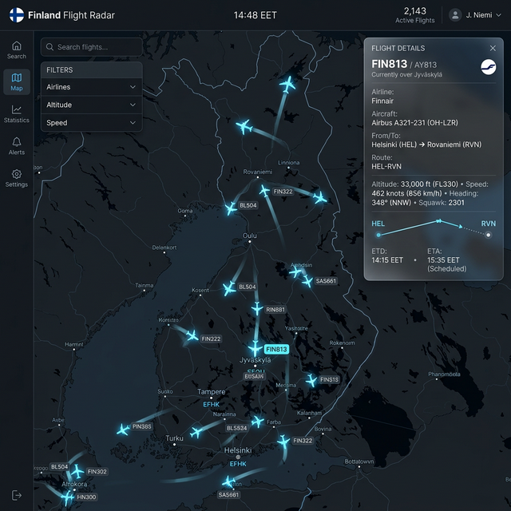
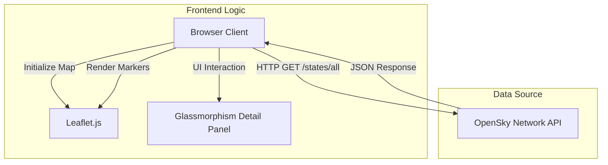

#  Flight Radar

A premium, high-performance web application for real-time flight tracking. This project leverages the **OpenSky Network API** and **Leaflet.js** to provide a sleek, dark-mode aviation dashboard.
Prompt : Make a flight radar appliction using Open radar Api. It should be finland specific only.



## 🏗 Architecture Overview

The application follows a lightweight, client-side architecture designed for performance and real-time updates.



### Component Breakdown
- **Frontend Logic (`app.js`)**: Manages the state of aircraft, handles the polling loop, and calculates rotations for markers.
- **Rendering Engine (`Leaflet.js`)**: Handles the geospatial rendering of map tiles and aircraft locations.
- **Styling (`style.css`)**: Implements a "Glassmorphism" design system using CSS back-drop filters and dark-mode color palettes.

## 📡 API Implementation

The heart of the application is the integration with the **OpenSky Network API**.

### 1. Geographical Filtering (Geofencing)
To ensure the application is Finland-specific, we use a **Bounding Box** filter directly in the API request. 

- **Finland Bounding Box**:
  - `lamin`: 59.5 (South)
  - `lomin`: 19.5 (West)
  - `lamax`: 70.1 (North)
  - `lomax`: 31.5 (East)

**API Endpoint URL:**
```
https://opensky-network.org/api/states/all?lamin=59.5&lomin=19.5&lamax=70.1&lomax=31.5
```

### 2. Data Processing Logic
The `app.js` fetches data every 30 seconds. The response is an array of state vectors. Our implementation mapping:
- `states[0]`: ICAO24 (Unique ID)
- `states[1]`: Callsign
- `states[5/6]`: Longitude/Latitude
- `states[7]`: Barometric Altitude
- `states[9]`: Velocity (m/s)
- `states[10]`: True Track (Heading)

### 3. Real-time Marker Smoothing
The application maintains a `markers` object in memory. On every refresh:
- Existing markers are updated to new positions.
- New markers are created for incoming flights.
- Markers for aircraft that have left the bounding box are removed to optimize memory.

## ✨ Premium UI Features

- **Dark Mode Aesthetic**: Uses CartoDB Dark Matter tiles for a professional aviation look.
- **SVG Aircraft Markers**: Unlike generic icons, we use custom SVGs that rotate dynamically based on the aircraft's heading (`true_track`).
- **Glassmorphism Detail Panel**: A side panel that appears with a blur effect, providing detailed flight statistics.
- **Auto-Refresh Timer**: A transparent countdown letting the user know when the next data batch arrives.

## 🚀 Getting Started

### Prerequisites
- Any modern web browser.
- (Optional) A local web server like `npx serve` or Live Server.

### Installation
1. Clone the repository.
2. Open `index.html` in your browser.
3. If running locally with `npx serve`:
   ```bash
   npx serve
   ```
   Navigate to `http://localhost:3000`.

---
*Developed with ❤️ for  Aviation Enthusiasts.*
